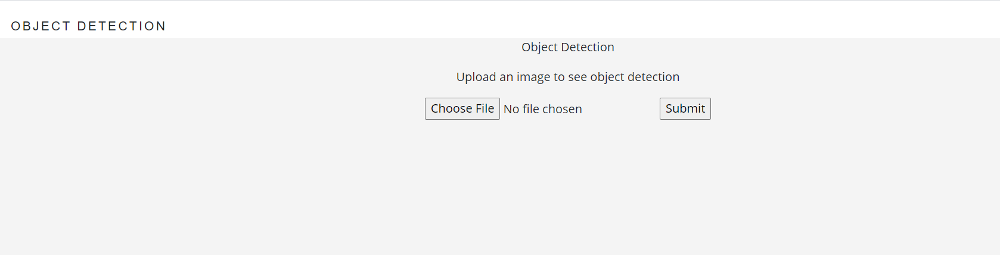
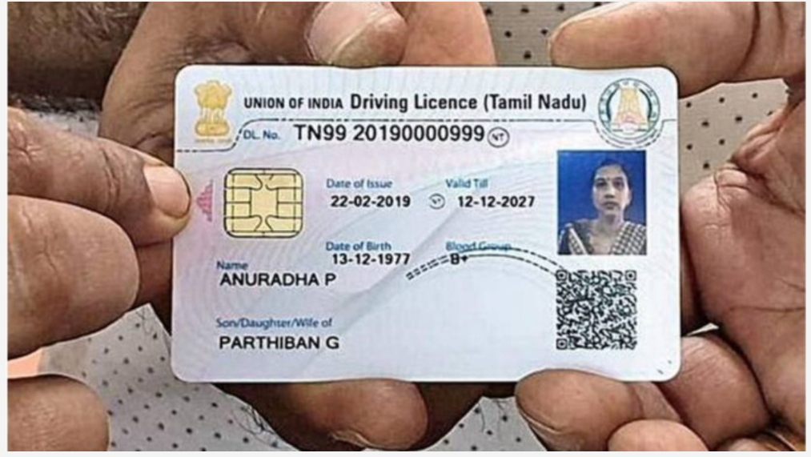
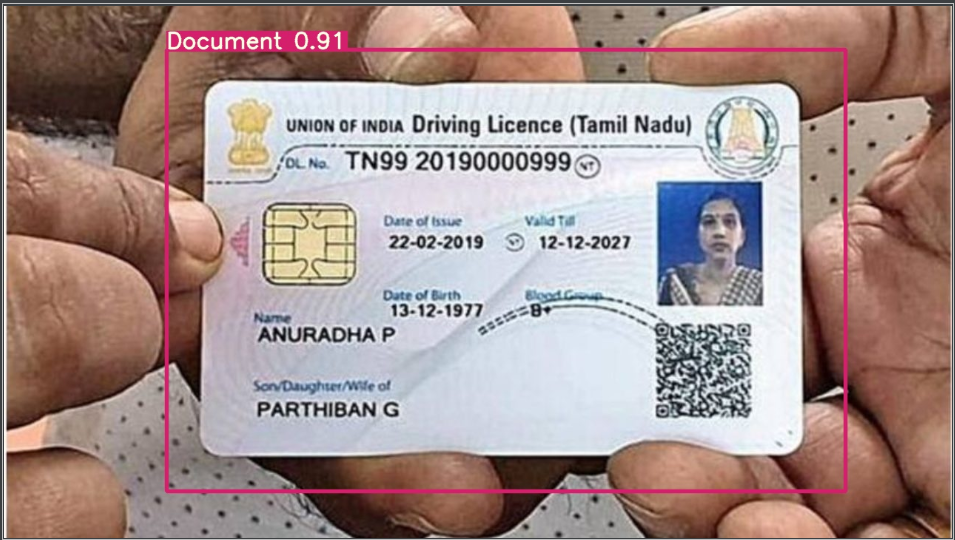

##Document Detection Model (YOLOv5):
This project is an attempt to provide a framework for document detection *(whether an image is valid document or not)* using YOLOv5 model which can be hosted anywhere without any difficulty. The  

#### How to Setup and Run:
1.	Download Project from github
2.	Setup environment in your PC
3.	Install dependencies using requirements.txt
4.	Open Object Detection Model project in your system
5.	Run app.py file to run the model for fresh prediction
6.	Take image input from any folder and see the prediction
7.  Save the detected image in the folder

#### API Interface:

#### Detection Sample Input:

#### Detection Sample output:

#### About YOLO Model : Object Detection
YOLO is a state-of-the-art, real-time object detection algorithm. In this notebook, we will apply the YOLO algorithm to detect objects in images. darknet prints out the objects it detected, its confidence, and how long it took to find them. We didn't compile Darknet with OpenCV so it can't display the detections directly. Instead, it saves them in predictions.png. You can open it to see the detected objects. Since we are using Darknet on the CPU it takes around 6-12 seconds per image. If we use the GPU version it would be much faster.

####Reference 
1. https://models.roboflow.com/object-detection/yolov5
2. https://roboflow.com/
3. https://pjreddie.com/darknet/yolo/
4. https://machinelearningmastery.com/how-to-perform-object-detection-with-yolov3-in-keras/

#### Team Members:
1.	Shiv (TL)
2.	Meenu Shekhawat
3.	Debargha
4.	Harsh

